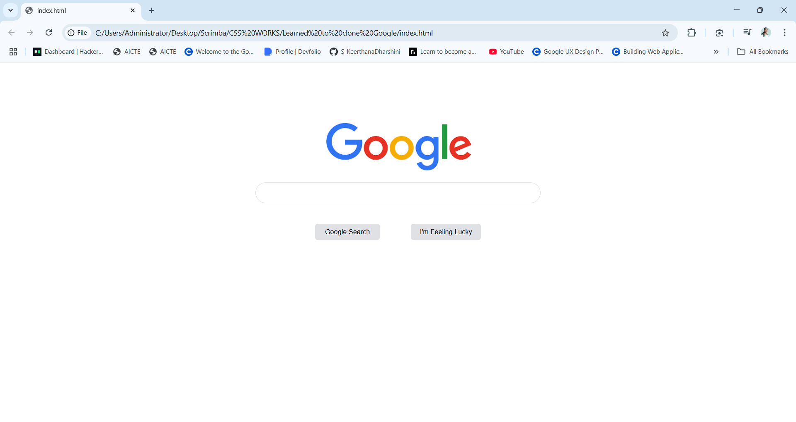

# 🔍 GOOGLE HOMEPAGE CLONE  
A basic replica of the Google search page using HTML and CSS. Clean layout, centered design, and simple search interface.

## 🌐 Live Demo  
Check out the deployed project here:  
👉 [GOOGLE HOMEPAGE CLONE on Netlify](https://shiny-paletas-46a04e.netlify.app/)

## 🛠️ Tech Used  
- HTML 🧱  
- CSS 🎨

## 📸 Output Screenshot  

## 🌱 About  
I'm currently learning HTML and CSS through small practice projects.  
This repo will grow as I explore layout styles, components, and creative designs! ✨

## 📬 Contact  
📧 keerthanasaravanan215@gmail.com  
🔗 [GitHub Profile](https://github.com/S-KeerthanaDharshini)

> "Every line of code is a step forward. Keep building!" 🌟

